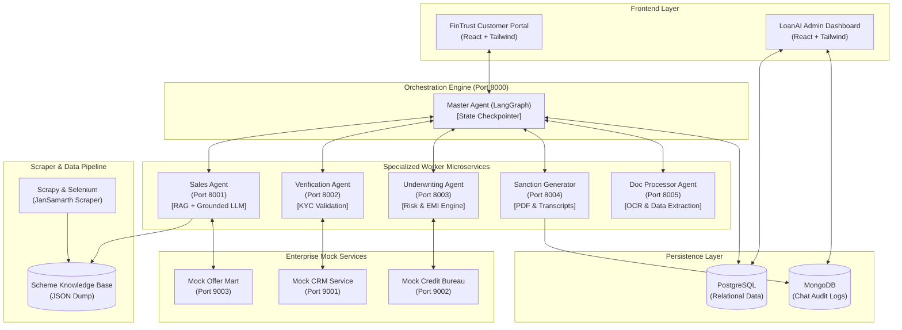

# 🤖 Autonomous Agentic AI Loan Sales & Processing Platform

[](https://www.python.org/)
[](https://fastapi.tiangolo.com/)
[](https://www.langchain.com/langgraph)
[](https://ai.google.dev/)
[](https://reactjs.org/)
[](https://www.postgresql.org/)
[](https://www.mongodb.com/)
[](https://tailwindcss.com/)

> An enterprise-grade, multi-agent autonomous loan application, sales, and underwriting system. Combining the flexible conversational capabilities of **Google Gemini 1.5 Flash** with deterministic Python microservices, **LangGraph** orchestration, **Tesseract OCR** document intelligence, and dynamic web scrapers for live scheme discovery.

---

## 🌟 Key Highlights & Architecture Features

- 🧠 **Intelligent Master Orchestration (LangGraph)**  
  Uses a centralized state machine with state checkpointing (`checkpointer.sqlite`) to track user context, evaluate intents, and dynamically route execution across worker agent microservices.

- 📄 **Document Intelligence & OCR Engine**  
  Dedicated **DocProcessor Agent** leverages **Tesseract OCR**, **PyMuPDF**, and **Pillow** to parse uploaded KYC documents (PAN, Aadhaar) and salary slips, extracting structured personal and financial details automatically.

- 📊 **Dynamic Risk-Based Underwriting Engine**  
  Automates credit risk evaluation by fetching real-time/mock CIBIL scores, applying dynamic interest rate tiering, evaluating EMI-to-income ratios, and generating instant loan approvals or rejections.

- 🌐 **Hybrid Sales & Grounded Scheme Knowledge**  
  Combines pre-approved offer lookup with Google Gemini RAG grounded by **Scrapy & Selenium** web scrapers to provide real-time information on government financial schemes (e.g., *JanSamarth*) and customized loan options.

- 📝 **Automated PDF Sanction Letter Generation**  
  Generates legally structured, customizable PDF Sanction Letters on loan approval using `FPDF` and saves them for user download.

- 🗄️ **Dual Data Persistence Model**  
  - **PostgreSQL**: Stores relational domain entities (customers, loan applications, status tracking, and interest options).  
  - **MongoDB**: Archives full chat transcripts, step-by-step agent telemetry, and system events for complete audit compliance.

- 💻 **Dual Modern Web Portals**  
  - **FinTrust Customer Portal**: High-conversion, responsive conversational chat UI for prospective borrowers.  
  - **LoanAI Admin Portal**: Command center dashboard for loan officers to review leads, audit agent decisions, and monitor applications.

---

## 🏗️ System Architecture



---

## 🧩 Microservices Ecosystem & Port Registry

The platform runs as a microservices cluster where each component handles a focused domain responsibility:

| Service Name | Port | Base Framework | Primary Responsibility |
| :--- | :---: | :---: | :--- |
| **Master Agent** | `8000` | FastAPI / LangGraph | Orchestrates conversation flow, state routing, and worker invocation. |
| **Sales Agent** | `8001` | FastAPI / Gemini | Matches pre-approved offers & answers queries grounded in scheme data. |
| **Verification Agent** | `8002` | FastAPI | Validates customer identity against CRM registries. |
| **Underwriting Agent** | `8003` | FastAPI | Computes risk tiering, interest rates, EMI eligibility, and approval status. |
| **Sanction Generator** | `8004` | FastAPI / FPDF | Generates PDF sanction letters and pushes chat logs to MongoDB. |
| **Doc Processor** | `8005` | FastAPI / Tesseract | Performs OCR on uploaded KYC documents and salary slips. |
| **Mock CRM** | `9001` | FastAPI | Simulates core banking customer demographic records. |
| **Mock Credit Bureau** | `9002` | FastAPI | Simulates credit scoring agencies (e.g., CIBIL scores). |
| **Mock Offer Mart** | `9003` | FastAPI | Provides active promotional loan limits and rate matrices. |

---

## 📁 Repository Structure

```text
Agent-AI-for-loan-scheme-generation/
├── backend/
│   ├── agents/
│   │   ├── doc_processor/          # OCR text extraction engine (Tesseract/PyMuPDF)
│   │   ├── sales_agent/            # LLM sales advice & RAG scheme lookup
│   │   ├── sanction_generator/     # PDF Sanction Letter builder & Mongo logger
│   │   ├── underwriting_agent/     # CIBIL risk calculation & approval engine
│   │   └── verification_agent/     # Identity verification microservice
│   ├── db/
│   │   └── setup_postgres_db.py    # PostgreSQL table migration & seed script
│   ├── master_agent/               # LangGraph orchestrator & state machine
│   ├── mock_services/              # Mock CRM, Credit Bureau & Offer Mart APIs
│   ├── scrappers/                  # Scrapy/Selenium web scrapers for schemes
│   │   └── data/                   # Scraped scheme knowledge base JSONs
│   ├── requirements.txt            # Python dependency specifications
│   └── run_all.ps1                 # PowerShell multi-service launch script
├── frontend/
│   ├── loanai-admin-portal/        # Admin operations dashboard (React + Vite)
│   └── UI/
│       └── fintrust-portal/        # Borrower-facing chat & application portal
└── README.md                       # System documentation
```

---

## 🛠️ Installation & Prerequisites

### 1. System Requirements
Before running the application, ensure the following are installed on your system:
- **Python**: `v3.10` or higher (Python 3.11 recommended)
- **Node.js**: `v18` or higher (with `npm` or `bun`)
- **PostgreSQL**: `v14` or higher
- **MongoDB**: `v6.0` or higher
- **Tesseract OCR Engine**:
  - **Windows**: Download installer from [UB-Mannheim Tesseract](https://github.com/UB-Mannheim/tesseract/wiki) and add to path (e.g., `C:\Program Files\Tesseract-OCR\tesseract.exe`).
  - **Linux/Mac**: `sudo apt install tesseract-ocr` or `brew install tesseract`.

---

### 2. Backend Setup

1. **Navigate to the backend directory and create a Python virtual environment:**
   ```bash
   cd backend
   python -m venv venv
   ```

2. **Activate the virtual environment:**
   - **Windows (PowerShell):**
     ```powershell
     .\venv\Scripts\Activate.ps1
     ```
   - **Linux / macOS:**
     ```bash
     source venv/bin/activate
     ```

3. **Install dependencies:**
   ```bash
   pip install -r requirements.txt
   ```

---

### 3. Database Initialization

1. Start your local **PostgreSQL** and **MongoDB** instances.
2. Create a PostgreSQL database named `loan_chatbot_db`.
3. Run the database migration script to construct tables (`customers`, `loans`, `chat_messages`) and seed initial dummy records:
   ```bash
   cd backend/db
   python setup_postgres_db.py
   ```

---

### 4. Environment Variables Configuration

Create a `.env` file inside `backend/` (and inside individual agent folders if needed):

```env
# Google Gemini AI Key
GOOGLE_API_KEY=your_gemini_api_key_here

# PostgreSQL Database Configuration
DB_NAME=loan_chatbot_db
DB_USER=postgres
DB_PASSWORD=your_postgres_password
DB_HOST=localhost
DB_PORT=5432

# MongoDB URI Configuration
MONGO_URI=mongodb://localhost:27017/

# Tesseract Executable Path (Windows example)
TESSERACT_CMD=C:/Program Files/Tesseract-OCR/tesseract.exe
```

---

## 🚀 Running the Platform

### Option A: Launch All Backend Services Automatically (Windows)
Run the provided PowerShell startup script from the `backend/` folder to spawn all 9 microservices simultaneously in distinct windows:
```powershell
cd backend
.\run_all.ps1
```

### Option B: Launch Frontends

1. **Launch FinTrust Customer Portal:**
   ```bash
   cd frontend/UI/fintrust-portal
   npm install
   npm run dev
   ```
   *Access the customer chat UI at `http://localhost:5173`*

2. **Launch LoanAI Admin Portal:**
   ```bash
   cd frontend/loanai-admin-portal
   npm install
   npm run dev
   ```
   *Access the admin dashboard at `http://localhost:5174`*

---

## 🔄 End-to-End Application Workflow

```text
  1. USER INQUIRY ────────► Master Agent receives query via FinTrust Portal.
  2. SALES & SCHEMES ─────► Sales Agent returns pre-approved offer or scraped scheme info.
  3. VERIFICATION ────────► Verification Agent validates PAN / Aadhaar with Mock CRM.
  4. DOC PROCESSING ──────► DocProcessor Agent extracts salary & KYC details via Tesseract OCR.
  5. UNDERWRITING ────────► Underwriting Agent fetches credit score, checks EMI ratio & decides loan approval.
  6. SANCTION & AUDIT ────► Sanction Generator creates PDF letter & archives chat logs to MongoDB.
```

---

## 🔮 Future Roadmap

- 🗣️ **Multilingual Support (Bhashini / Vernacular AI)**: Native integration for regional Indian languages (Hindi, Tamil, Kannada, Marathi) translating real-time dialogue.
- 🎙️ **Voice-to-Apply (Whisper STT + TTS)**: Speech interaction allowing users to complete end-to-end applications hands-free.
- 🤖 **Automated Web RPA (Selenium / Puppeteer Agents)**: Robotic Process Automation to assist users in auto-filling government loan applications on portals like *JanSamarth*.

---

## 📄 License & Acknowledgments

Distributed under the **MIT License**. See `LICENSE` for details.  
*Built with ❤️ using LangGraph, Google Gemini, FastAPI, and React.*
